# 🔋 BforU (임의 프로젝트명)

 

## 💭 주제

- 차량 보험사와 xEV 배터리 팩의 정보 연동 서비스 개발

 

## 📅 기간

- 2023.04.10 ~ 2023.05.19

 

## 🙌 목적 및 핵심내용

- **목적**
  - 편리하게 배터리 정보를 확인할 수 있게 하기 위함.
    - 개인 : BMS 셀 단위의 데이터 제공과 AI기반 각종 인사이트를 제공
    - 보험사 : 보험료 산정 용이
- **목표**
  - 전기차 배터리 팩 정보를(셀, 모듈, 팩) BMS/ECU를 통해 서버와 데이터를 연동하는 API 구현
    - BMS : Battery Management Systems / ECU : Electronic Control Unit
  - 수리 & 교체 이력을 포함한 배터리 팩 정보를 보험사, 차량 사용자에게 제공하는 서비스 구현

 

## 😊 참여 인원 및 역할

| 이름   | 역할              |
| ------ | ----------------- |
| 권성현 | #웹 프론트엔드    |
| 류기혁 | #임베디드         |
| 성정언 | #앱 프론트엔드    |
| 양희진 | #백엔드 #CI/CD    |
| 장미림 | #백엔드           |
| 정원웅 | #AI #데이터시각화 |

 

## 🚦 목차

1. [**프로젝트 컨셉 및 주요 기능**](#1)
1. [**개발 환경 및 문서**](#2)
1. [**시연 시나리오**](#3)
1. [**HAST UCC**](#4)

 

# 🌈 프로젝트 컨셉 및 주요 기능

## 배경

- 전기차 제조사들이 배터리 테스트 결과와 수리 데이터를 공개하지 않기에, 미국 자동차 보험사들은 차량 사고시 배터리 테스트, 문제 셀을 교체하기보다 전기차 전체를 전손 처리하는 편이다.
- 이에, 셀이 멀쩡해도 배터리 팩 외부에 긁힌 자국만 있으면 바로차를 폐차하므로, 전기차 전체 보험료가 오르는 부작용이 있다.
- 2022년 TESLA 전기차의 평균 보험료는 매달 251달러이다.이것은 미국의 전국 평균 보험료인 144달러보다 70%이상 비싸다.

 

## 사용자 대상자

- 사내 BMS개발 실무자
- 삼성SDI 배터리 팩이 적용된 차량의 소유자
- 차량 보험업체 시스템

 

## 주요 기능

1. 서버와 데이터 연동을 위한 BMS 전송 API 개발
   - STM32와 STMcudeIDE를 활용해 데이터 전송 API를 개발
   - 프로토콜을 HTTP를 사용
   - 아두이노가 아닌 STM32를 채한 이유는 실제 개발 및 제작에 더 가까운 용도를 가지고 있기 때문
2. 배터리 팩의 정보를 제공하는 Web & App Service 구현
   - 개인 사용자에게는 사용의 편의를 위한 React Native로 개발한 앱 제공
   - 보험사에게는 사무적 용도를 위한 React로 개발한 웹 제공
3. 클라이언트 인증 시스템 보안
   - 개인 정보인 BMS를 안정적으로 보내기 위한 보안 구현
   - 보험사가 개인의 승인을 받아야 접근 가능, 사용자에게 푸쉬 알림 전송
   - 한 번 열람한 BMS 데이터는 일정 기간 이후 권한 박탈
4. BMS API의 성능 프로파일 SW 구현 (간소화)
5. 배터리 팩 데이터를 분석하여 정보를 제공하는 기능 구현
   - BSM에서 제공하는 기본 데이터 전압, 전류, 온도 기반으로 유용한 데이터 생서
   - 사용자 편의에 근건한 데이터를 제공
6. 한국환경공단 제공 API EV충전소 위치 제공
   - 한국환경공단에서 제공하는 전기차 충전소 API를 지도에 표시
   - 사용자가 가입되어 있는 전기 충전소 회사별로 필터링 하는 기능 제공
7. 동일 스펙 내연기관 차량대비 탄소 절감효과 안내
   - 친환경을 생각하는 전기차 사용자들에게 본인의 노력을 지표로 확일할 수있는 기능 제공
   - 탄소 g , 나무 심은수, 주유 대비 절약한 충전 비용 산정 제공
8. 주행 거리, 배터리 상태 예측, 주행 기록 이상치 탐지 AI - 전기차 배터리에 대한 종합 정보와, 예상 주행거리, 배터리 수명, 배터리 상태 진단을 수행
    

## 기대효과

- 배터리 팩 정보를 보험사, 차량 사용자에게 제공하여 보험료 인하
  - 셀 단위 수준의 배터리 정보를 제공함으로써 고객, 보험사에 보험료 책정의 근거가 됨
- 전류, 전압, 온도 등의 배터리 모니터링으로 이상치 감지하여 문제 예방 가능
- AI 모델 기반으로 배터리 잔존 수명, 배터리 이상, 주행거리 등 예측 가능
- 전기차 사용자에게 편의 제공 및 전기차 생태계 조성에 기여

 

# 🔮 개발 환경 및 문서

## 아키텍처 구조

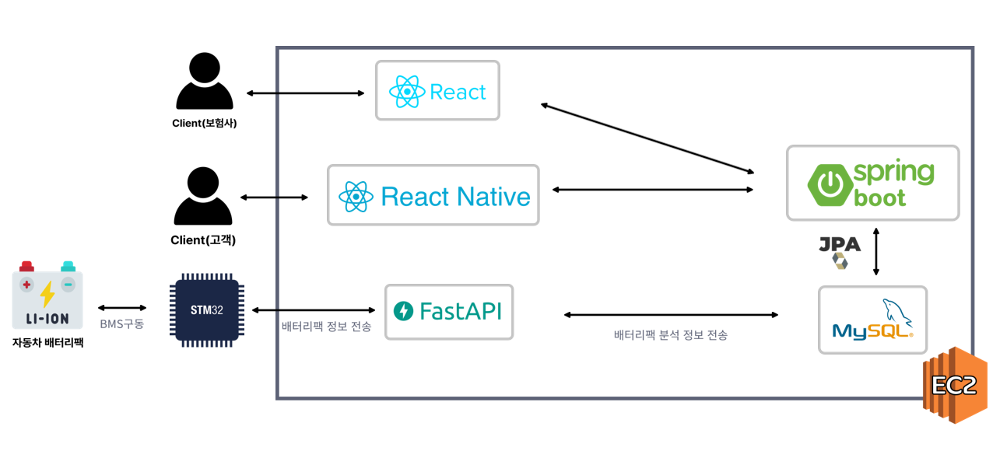

## Entity Relationship Diagram

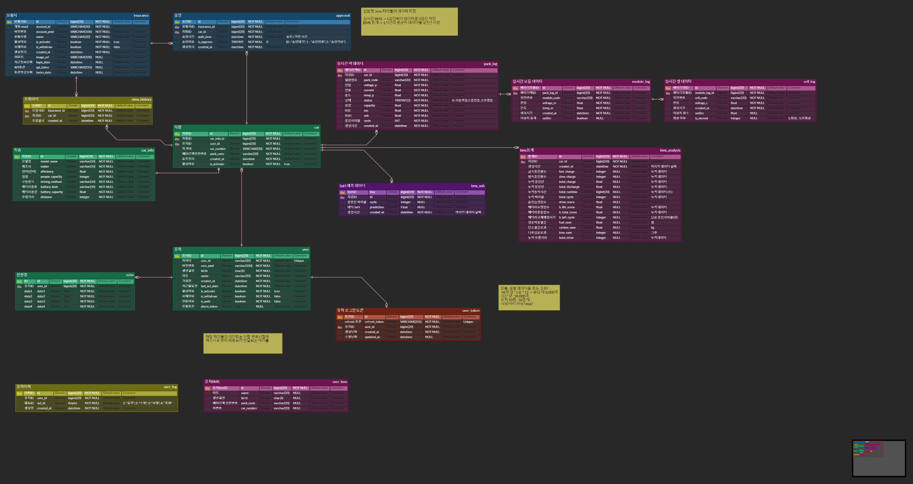

## 와이어 프레임 - 개인사용자

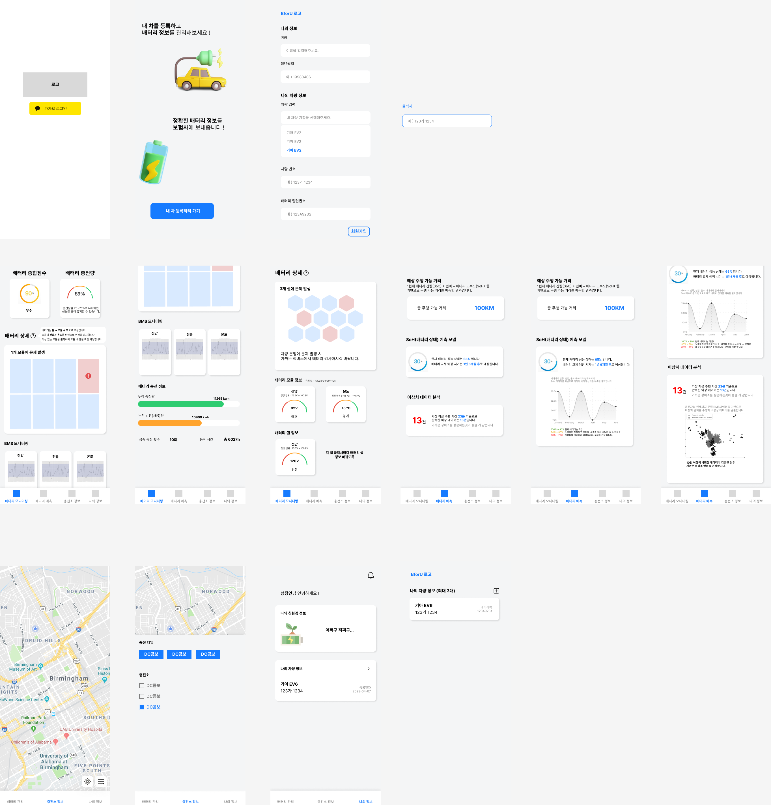

## 와이어 프레임 - 보험사

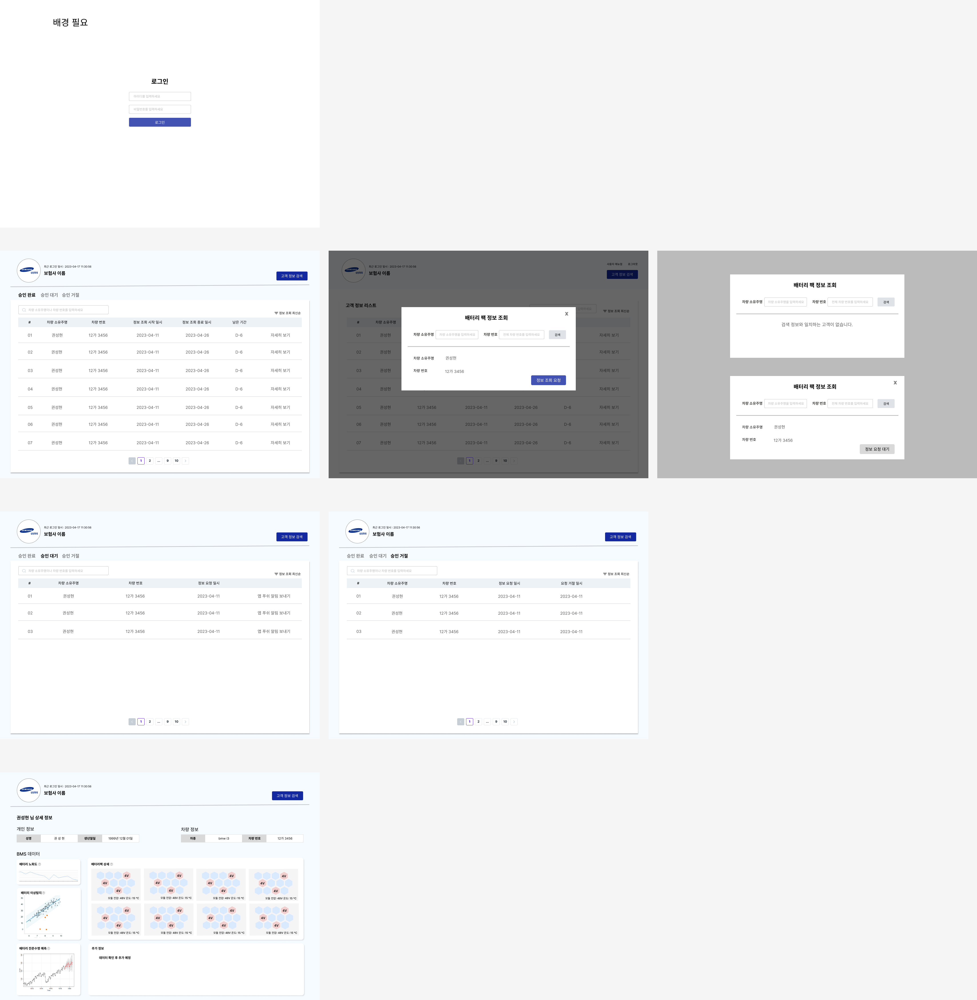

 

# 💫 시연 시나리오

## 1. 보험사 웹

### 로그인

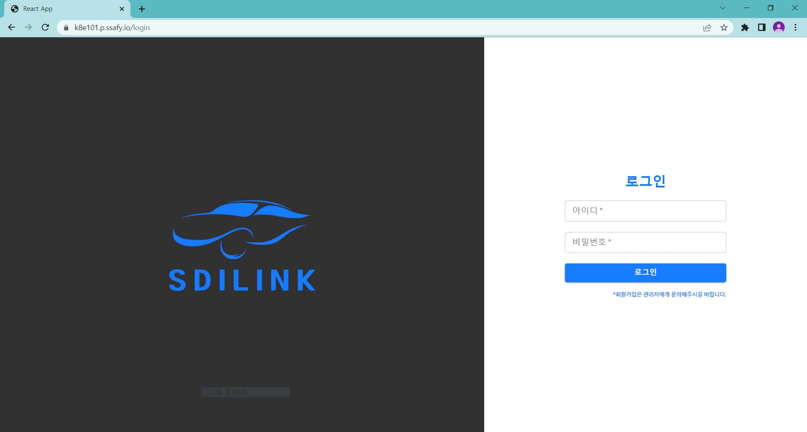

### 마이페이지

로그인 후 보험사별 메인페이지

- 최근 조회 목록 : 최근 조회 10개 데이터 노출
- 고객 검색 : 차량 소유주명과 차량 번호를 정확히 입력해야 정보 열람 승인 요청 가능
- 고객 관리 : 승인 완료, 승인 대기, 승인 거절 탭으로 고객 관리 가능
- 토큰 관리 : OPEN API 를 통한 데이터 조회 시 필요한 토큰 관리

.png>)

.png>)

### 고객 상세 페이지

고객 관리 탭의 승인 완료 고객에서 `자세히 보기` 클릭 시 고객 별 상세 페이지 이동

1. 차량 기본 정보

   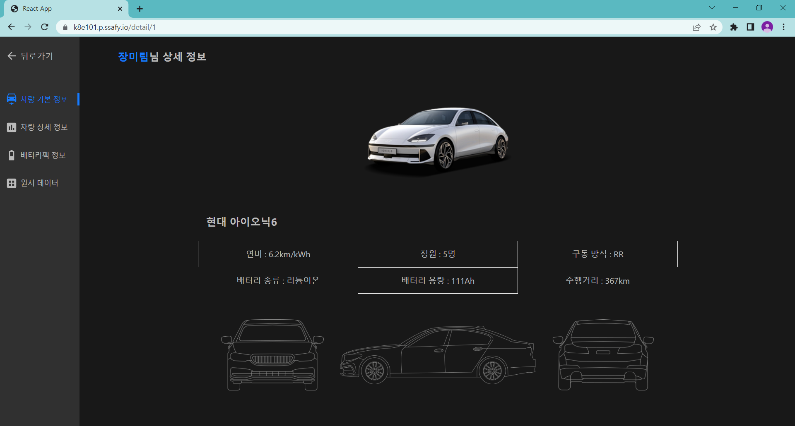

   고객 차량의 기본 정보

2. 차량 상세 정보

   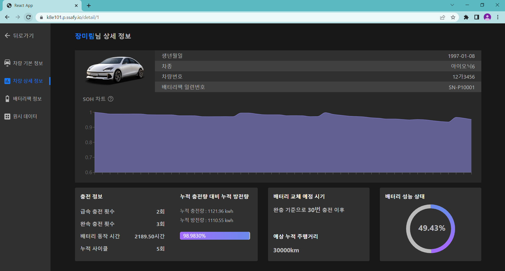

   고객 차량의 BMS 데이터를 기반으로 충·방전, 배터리 정보를 볼 수 있음

3. 배터리팩 정보 (BMS 데이터 활용 시각화)

   .png>)

   BMS 데이터를 시각화하여 셀 단위의 전압, 이상치까지 파악 가능

   .png>)

   정보 열람 시간 기준, 주행 3시간 전까지의 배터리팩 전압, 전류, 온도를 확인 가능하며,
   위의 배터리팩 시각화 그래프와 연동됨

4. 원시 데이터 조회
   - 배터리 팩
     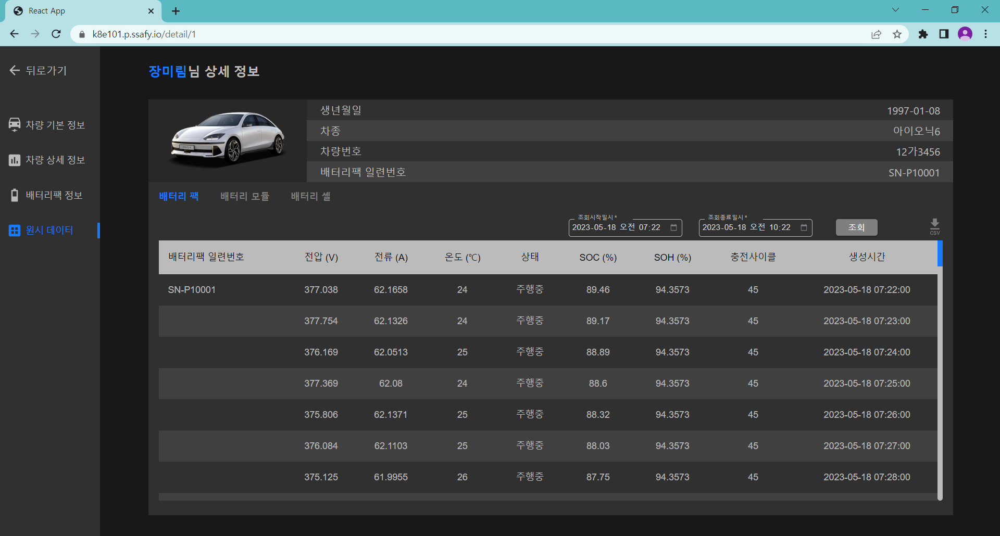
     배터리 팩의 전압, 전류, 온도, 상태, SOC, SOH, 충전 사이클, 생성 시간 데이터
   - 배터리 모듈
     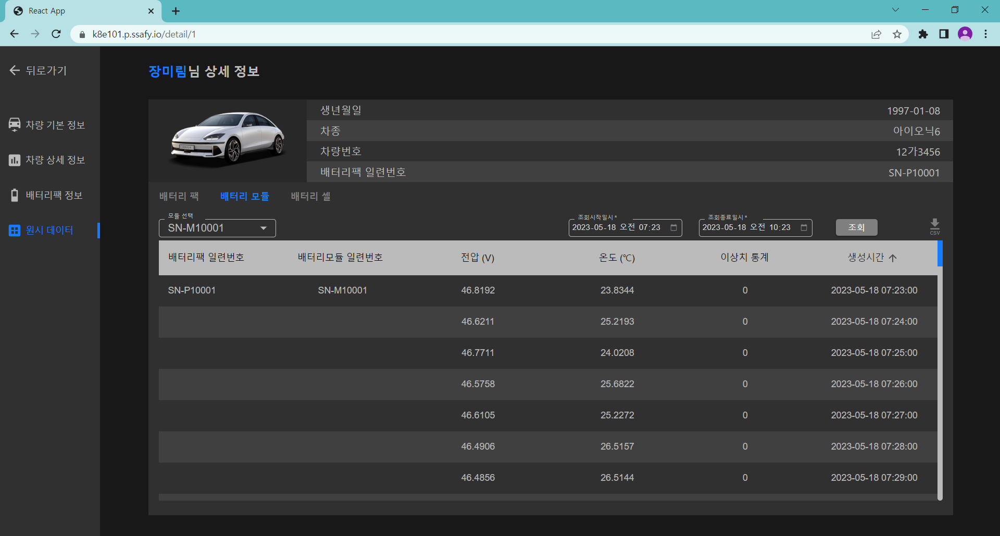
     배터리 모듈의 전압, 온도, 이상치 통계, 생성시간 데이터
   - 배터리 셀
     
     배터리 셀의 전압, 이상치, 생성시간 데이터
   - raw data → csv 다운로드 가능
     raw data 조회 후 csv 다운로드 가능
     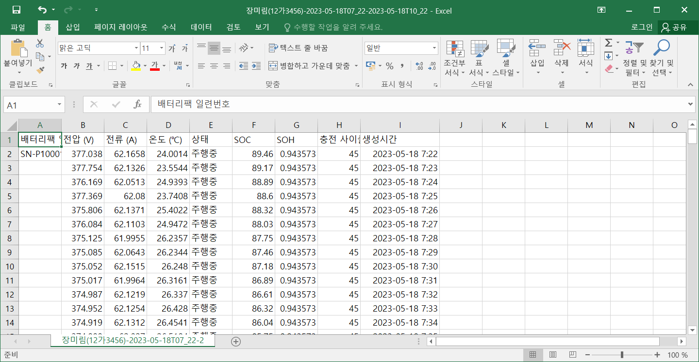

### OPEN API 를 통한 데이터 조회

api 토큰을 params로 하는 url로 JSON 데이터 접근 가능

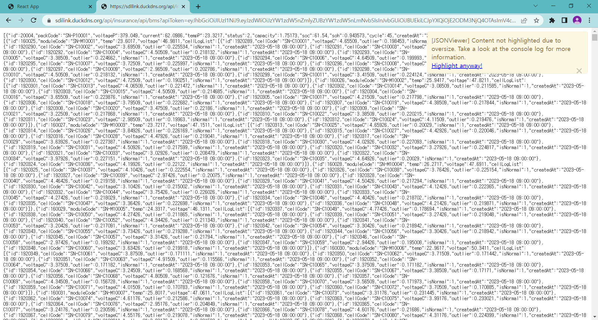

## 2. 개인 사용자 앱

### 메인페이지

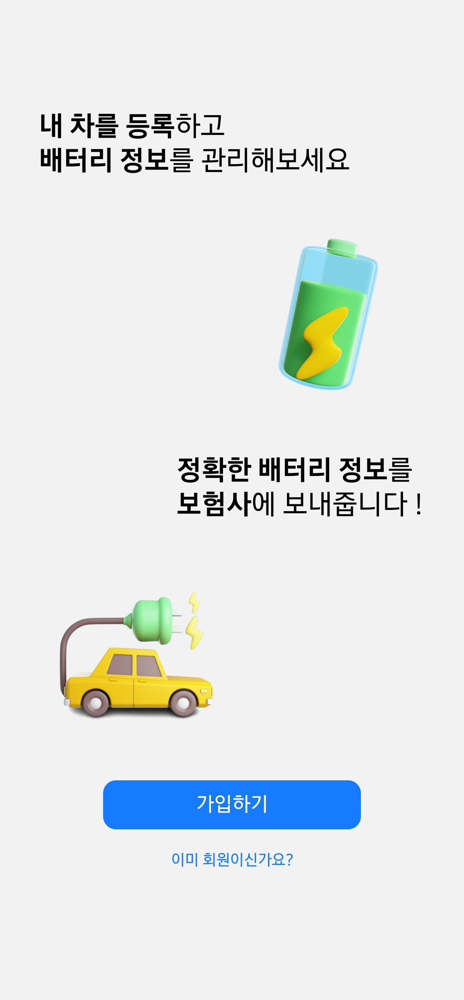

### 로그인

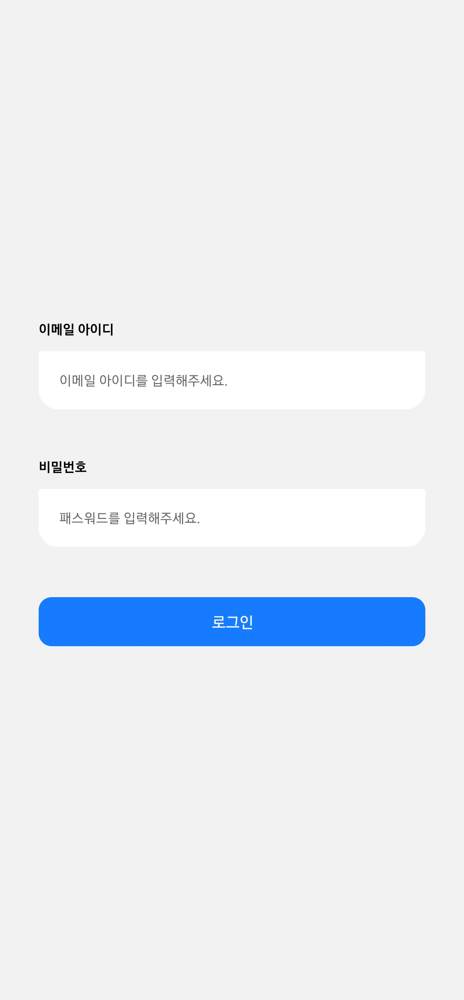

### 회원가입

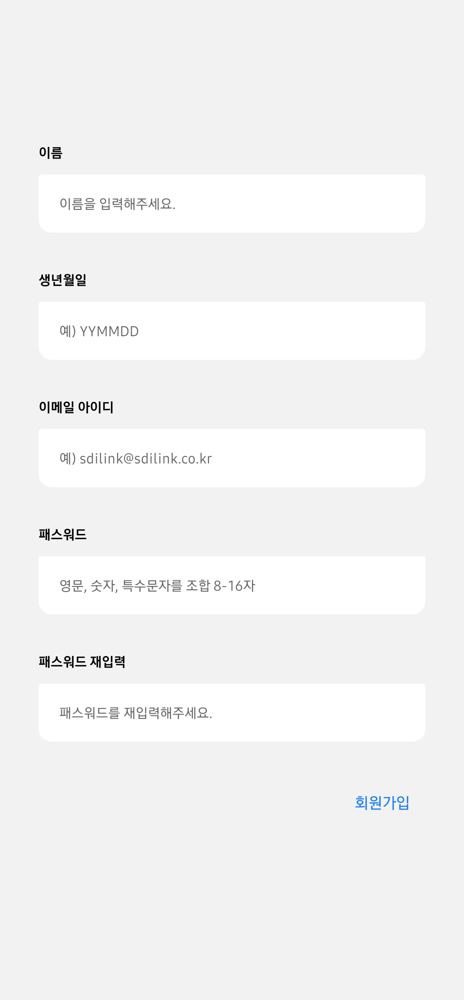

### 배터리 모니터링

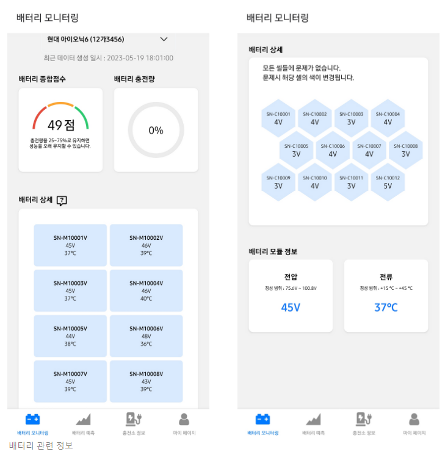
 
→ 배터리 상세 구역의 모듈 클릭 시 모듈 내 셀의 전압과 이상치를 확인 가능

.PNG>)
 
→ 배터리팩의 전압, 전류, 온도 그래프 및 충전 데이터

### 배터리 예측

하단의 배터리 예측 탭에서 조회 가능

### 충전소 정보

하단의 충전소 정보 탭에서 충전소 정보(위치, 이름, 기관 및 상세 정보) 확인 가능

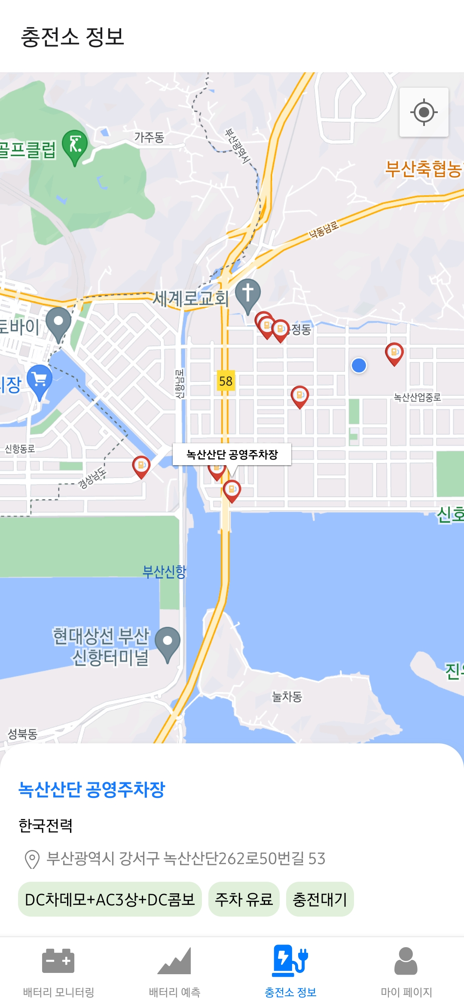

### 마이페이지

하단의 마이페이지 탭에서 확인 가능

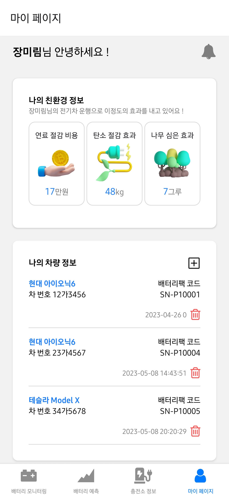

친환경 정보 조회 및 차량 정보 수정 가능

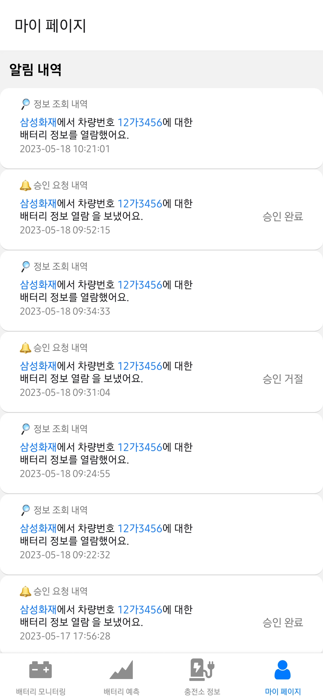

마이페이지 내 알림 아이콘으로 접근 가능

 

# 🎥 UCC

[ 차후 업로드 예정 ]
